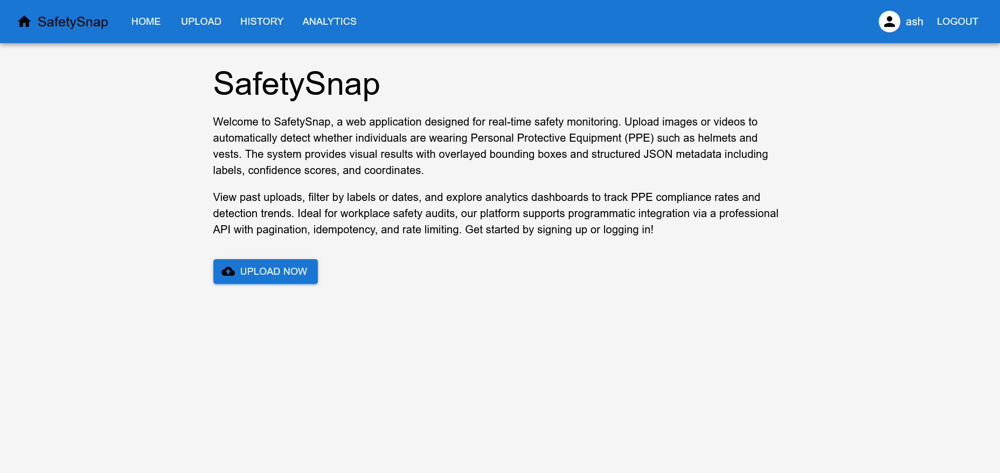
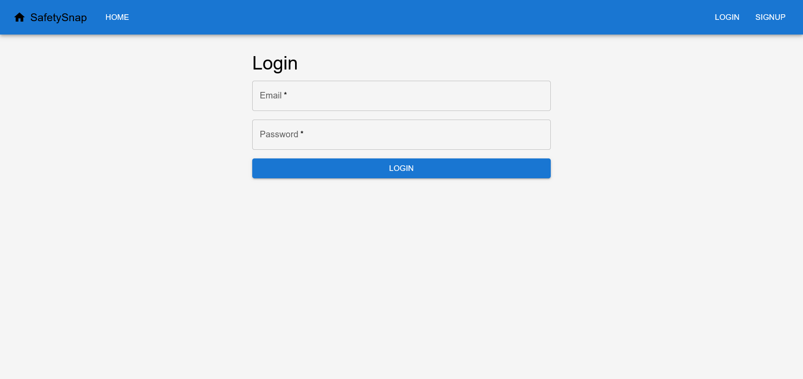
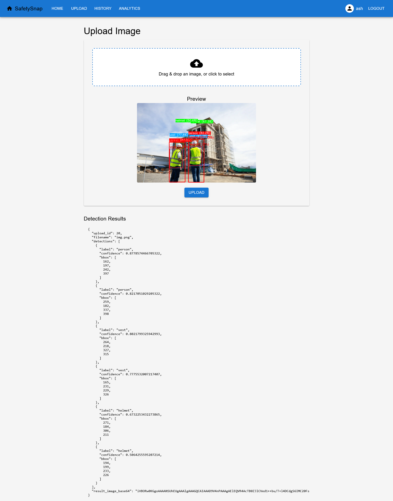
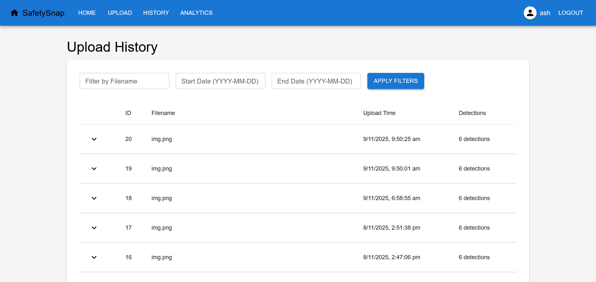
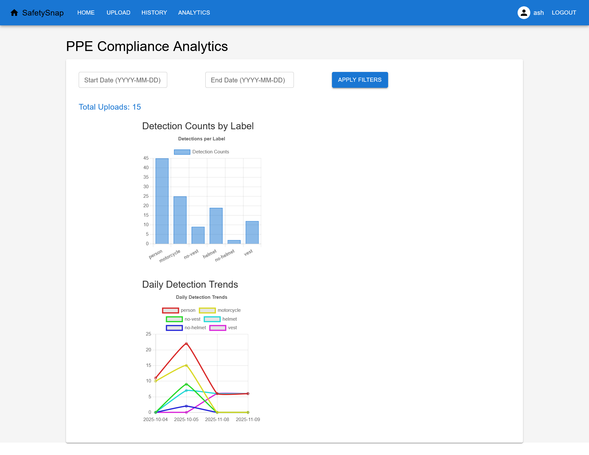

# 🦺 SafetySnap – AI-Powered PPE Detection System


## 🔗 Live Demos

| Platform | Link |
|-----------|------|
| 🚀 **Hugging Face Spaces** | [View App on Hugging Face](https://huggingface.co/spaces/akashwadode/SafetySnap) |


---

## 📘 Overview

**SafetySnap** is an **AI-powered Personal Protective Equipment (PPE) detection system** that ensures workplace safety by detecting **helmets**, **safety vests**, and **people** in uploaded images.

Built using **YOLOv8**, **FastAPI**, **Firebase**, and **SQLite**, SafetySnap allows users to upload images, view detection results, and analyze historical PPE compliance — all through a clean, modern interface.  
The application is deployed on **Streamlit Cloud** for live usage.

---

## ⚙️ Features

✅ **Helmet & Vest Detection** – Real-time image inference using YOLOv8.  
✅ **Secure Authentication** – Firebase Admin SDK handles user login and verification.  
✅ **Image Upload & Visualization** – Instantly view bounding box detections.  
✅ **Detection History** – Track previous uploads and detection details.  
✅ **Analytics Dashboard** – View label counts and detection trends.  
✅ **Streamlit Deployment** – Easily accessible, cloud-hosted application.  

---

## 🧩 Tech Stack

| Layer | Technology |
|-------|-------------|
| **Frontend** | React (Vite) |
| **Backend** | FastAPI |
| **AI Model** | YOLOv8 (Ultralytics) |
| **Authentication** | Firebase Admin SDK |
| **Database** | SQLite |
| **Deployment** | Streamlit Cloud |
| **Language** | Python 3.11 |

---

## 📁 Project Structure

```

SafetySnap/
│
├── src/
├── public/
└── package.json
│
├── backend/                 # FastAPI + YOLOv8 + Firebase + SQLite
│   ├── main.py              # Core API routes (upload, history, analytics)
│   ├── database.py          # SQLite initialization and helper functions
│   ├── yolov8_helmet_vest.pt# YOLOv8 model for PPE detection
│   ├── firebase-adminsdk.json (ignored)
│   └── requirements.txt
│
├── app.py                   # Streamlit app entry point
├── .gitignore
└── README.md

````
# 👥 Team & Contributions

| Member                  | Role                  | Contributions |
|-------------------------|-----------------------|-------------|
| **Akash Wadode** (Team Leader) | Backend & AI Developer | - Designed and implemented FastAPI backend.<br>- Integrated YOLOv8 model for PPE detection.<br>- Set up SQLite database for storing detection history and analytics.<br>- Configured Firebase Admin SDK for authentication.<br>- Developed Streamlit dashboard and deployed the full system.<br>- Managed project structure, documentation, and deployment pipeline. |
| **Kushvinder Singh** (Team Member) | Frontend Developer | - Built React (Vite) frontend for image upload, history, and analytics pages.<br>- Integrated Firebase authentication with the UI.<br>- Designed responsive user interface with modern components.<br>- Connected frontend with backend APIs for real-time detection and visualization.<br>- Contributed to overall UI/UX improvements and testing. |
---

## 🧰 Installation & Setup

### 🪜 1. Clone the Repository

```bash
git clone https://github.com/akashwadode/SafetySnap.git
cd SafetySnap
````

---

### ⚙️ 2. Backend Setup (FastAPI + YOLOv8)

```bash
cd backend
python -m venv venv
venv\Scripts\activate    # On Windows
# or
source venv/bin/activate # On Mac/Linux
pip install -r requirements.txt
```

> ⚠️ **Use Python 3.11** – it ensures compatibility with Ultralytics YOLOv8.

---

### 🚀 3. Run the Backend Server

```bash
uvicorn backend.main:app --reload
```

Your FastAPI backend will run at:
👉 [http://127.0.0.1:8000](http://127.0.0.1:8000)

---

### 💻 4. Frontend Setup (React + Vite)

```bash
cd ../frontend
npm install
npm run dev
```

Your frontend will be available at:
👉 [http://localhost:5173](http://localhost:5173)

---

### 🌐 5. Streamlit App (Deployed Version)

To run the Streamlit app locally:

```bash
streamlit run app.py
```

Or directly visit the live deployment:
🔗 [https://akashwadode-safetysnap-app-ucmqd9.streamlit.app/](https://akashwadode-safetysnap-app-ucmqd9.streamlit.app/)

---

## 🧠 How It Works

1. Users upload an image through the React frontend or Streamlit app.
2. The backend validates and processes the image using YOLOv8.
3. PPE detections (helmet, vest, person) are identified and annotated.
4. The results are stored in SQLite for history and analytics.
5. The results and trends are displayed on an interactive dashboard.

---

## 🧾 API Endpoints

| Method | Endpoint     | Description                              |
| ------ | ------------ | ---------------------------------------- |
| `POST` | `/upload`    | Upload an image for YOLOv8 PPE detection |
| `GET`  | `/history`   | Retrieve user’s past detections          |
| `GET`  | `/analytics` | Get detection statistics & trends        |
| `GET`  | `/`          | Health check endpoint                    |

---

## 📸 Screenshots

| Page                       | Preview                                 |
| -------------------------- | --------------------------------------- |
| 🏠 **Home Page**           |            |
| 🔐 **Login Page**          |          |
| 📤 **Upload & Result Page** |  |
| 🕓 **History Page**        |      |
| 📊 **Analytics Dashboard** |  |

> 📷 Place your screenshots inside a `/screenshots/` folder in the project root.

---

## ☁️ Streamlit Deployment Guide

1. Push your code to **GitHub**.
2. Go to [Streamlit Cloud](https://share.streamlit.io/).
3. Connect your repository.
4. Select `app.py` as the **entry file**.
5. Set **Python version = 3.11** in “Advanced Settings.”
6. Click **Deploy** – your app is live 🚀

---

## 📦 Requirements

* Python **3.11+**
* Node.js (for React frontend)
* Firebase Admin SDK (JSON credentials file)
* Required Python packages are listed in `backend/requirements.txt`

---

## 👨‍💻 Author

**Developed by [Akash Wadode](https://github.com/akashwadode)**
🎓 MCA Student – Specializing in AI & Machine Learning
💡 Passionate about creating intelligent and impactful software solutions.

---

## 🌟 Support

If you like this project, consider giving it a **⭐ Star** on GitHub — it motivates future innovation!

